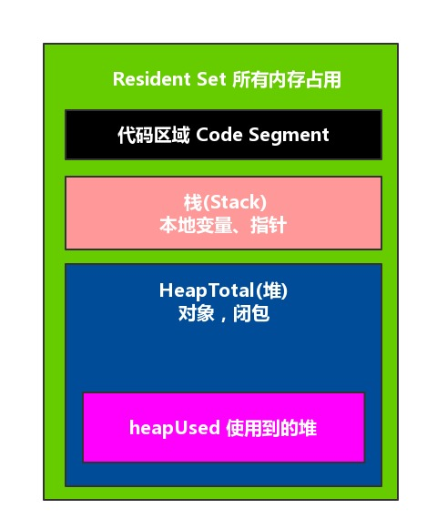
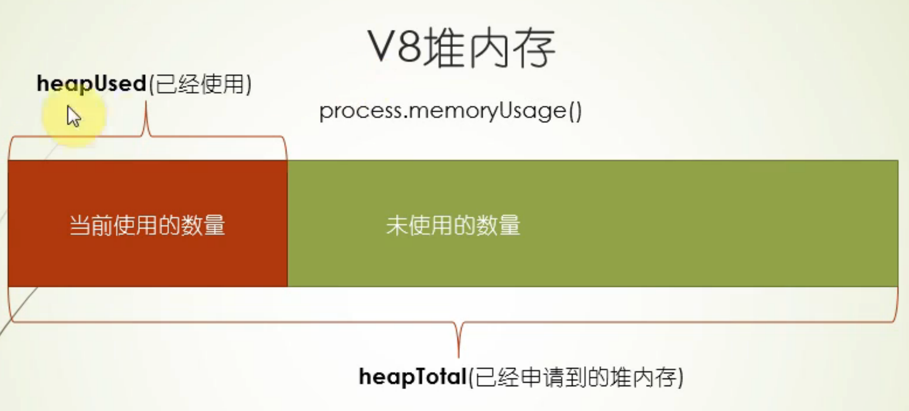
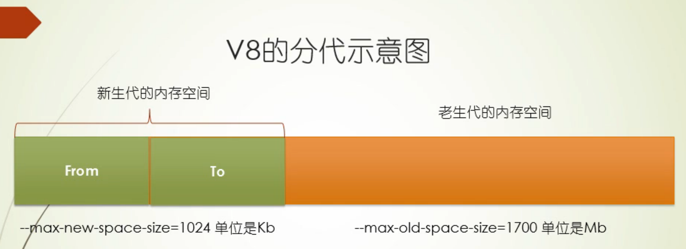
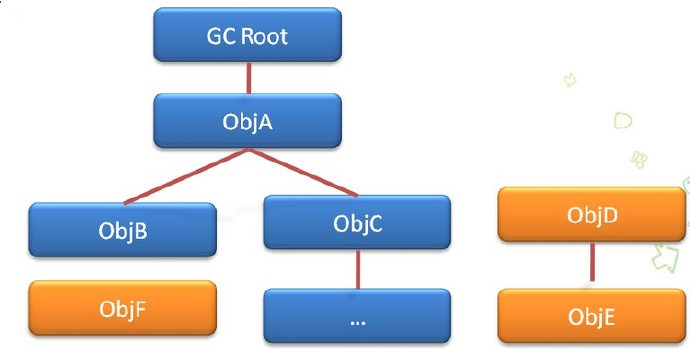
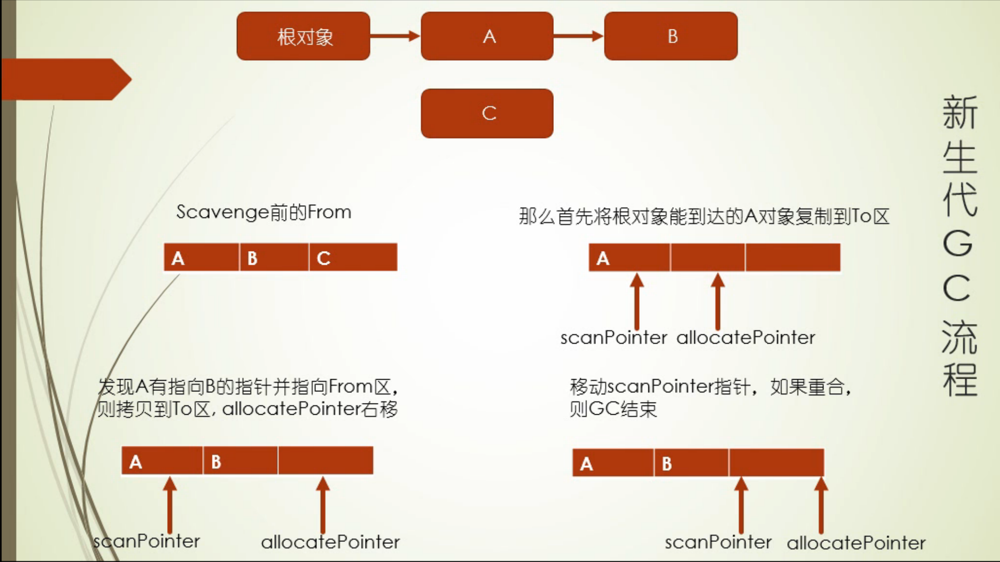
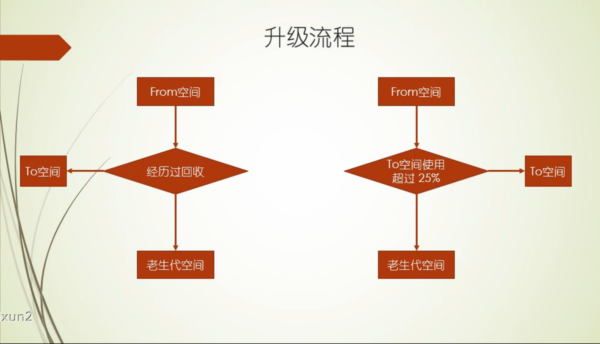
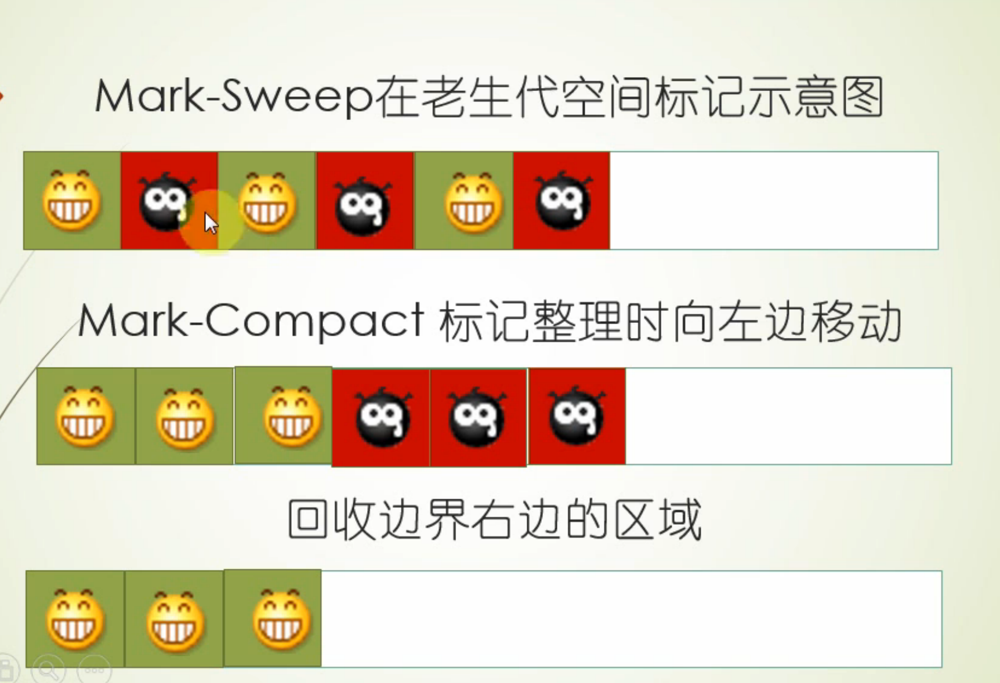
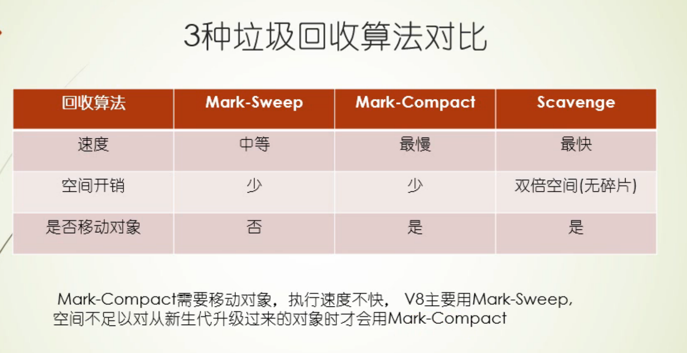

参考朴灵的《深入浅出Node.js》及[A tour of V8:Garbage Collection](http://www.jayconrod.com/posts/55/a-tour-of-v8-garbage-collection)，后者还有中文翻译版[V8 之旅](http://newhtml.net/v8-garbage-collection/)

<!-- more -->

## 1、Javascript中垃圾收集
> * 程序运行需要内存，只要程序要求，操作系统就必须提供内存
> * JavaScript使用自动内存管理，这被称为”垃圾回收机制”（garbage collector)
> * 优点是可以简化开发、节省代码
> * 缺点是无法完整的掌握内存的分配与回收的具体过程


### 1.1NodeJS中的内存管理
> * 网页端的内存泄漏，影响单个用户
> * 对于持续运行的服务进程Node服务器端程序,必须及时释放不再用到的内存。否则，内存占用越 来越高，轻则影响系统性能，重则导致进程崩溃,影响的不再是单个用户
> * 如果不再用到的内存没有及时释放，就叫做内存泄漏

<font style="font-size:12px;color:#777">注：在浏览器中，V8引擎实例的生命周期不会很长，而且运行在用户的机器上。如果不幸发生内存泄露等问题，仅仅会影响到一个终端用户。且无论这个V8实例占用了多少内存，最终在关闭页面时内存都会被释放，几乎没有太多管理的必要（当然并不代表一些大型Web应用不需要管理内存）。但如果使用Node作为服务器，就需要关注内存问题了，一旦内存发生泄漏，久而久之整个服务将会瘫痪（服务器不会频繁的重启）</font>

### 1.2V8内存管理
**V8内存限制**
> * 在64位操作系统可以使用1.4G内存
> * 在32位操作系统中可以使用0.7G内存

**V8内存管理**
> * JS对象都是通过V8进行分配管理内存的
> * process.memoryUsage
返回一个对象，包含了 Node 进程的内存占用信息
```
console.log(process.memoryUsage());
/*{
    rss: 19099648,
    heapTotal: 6066176,
    heapUsed: 3808560,
    external: 8264
}*/
```


rss（resident set size）：所有内存占用，包括指令区和堆栈。<br> heapTotal：”堆”占用的内存，包括用到的和没用到的<br> heapUsed：用到的堆的部分。判断内存泄漏，以 heapUsed 字段为准<br> external： V8 引擎内部的 C++ 对象占用的内存
<br>
大小关系: heapUsed < heapTotal < rss <br>




**为何限制内存大小**
> * 因为V8的垃圾收集工作原理导致的,内存越大垃圾收集时间越大
> * 垃圾回收的时候整个程序暂停stop-the-world，这个暂停期间，应用的性能和响应能力都会下降

<font style="font-size:12px;color:#777">V8之所以限制了内存的大小，表面上的原因是V8最初是作为浏览器的JavaScript引擎而设计，不太可能遇到大量内存的场景，而深层次的原因则是由于V8的垃圾回收机制的限制。由于V8需要保证JavaScript应用逻辑与垃圾回收器所看到的不一样，V8在执行垃圾回收时会阻塞JavaScript应用逻辑，直到垃圾回收结束再重新执行JavaScript应用逻辑，这种行为被称为“全停顿”（stop-the-world）。若V8的堆内存为1.5GB，V8做一次小的垃圾回收需要50ms以上，做一次非增量式的垃圾回收甚至要1秒以上。这样浏览器将在1s内失去对用户的响应，造成假死现象。如果有动画效果的话，动画的展现也将显著受到影响</font>

**如何打开内存限制**
> * 一旦初始化成功，生效后不能再修改
> * –max-new-space-size，最大 new space 大小，执行 scavenge 回收，默认 16M，单位 KB
> * –max-old-space-size，最大 old space 大小，执行 MarkSweep 回收，默认 1G，单位 M
```
node --max-old-space-size=2000 app.js 单位是M
node --max-new-space-size=1024 app.js 单位是k
```
## 2、V8的垃圾回收机制
> * V8是基于分代的垃圾回收
> * 不同代垃圾回收机制也不一样
> * 按存活的时间分为新生代和老生代

**分代**
> * 年龄小的是新生代,由From区域和To区域两个区域组成<br>
    >在64位系统里，新生代内存是32M,From区域和To区域各占用16M<br>
    >在32位系统里，新生代内存是16M,From区域和To区域各占用8M<br>
> * 年龄大的是老生代,默认情况下<br>
    >64为系统下老生代内存是1400M<br>
    >32为系统下老生代内存是700M



### 2.2引用计数
> * 语言引擎有一张引用表，保存了内存里面所有的资源的引用次数。
> * 如果一个值的引用次数是0，就表示这个值不再用到了，因此可以将这块内存释放。



```
function Person(name){
    this.name = name;
}
let p1 = new Person('zfpx1');
let p2 = new Person('zfpx2');
let arr = [p1];
setTimeout(function(){
    p1 = null;
    p2 = null;
},3000);
setTimeout(function(){
    arr = null;
},10000);
let arr = [];
setInterval(function(){
    let obj ={};
    for(let i=0;i<=10000000;i++){
        obj[i] = i;
    }
    arr.push(obj);
},500);
function Person(name){
    this.name = name;
}
let set = new Set();
let weakset = new WeakSet();
let p1 = new Person('zfpx1');
let p2 = new Person('zfpx2');
set.add(p1);
weakset.add(p2);
p1=null;
p2=null;
```


### 2.3新生代垃圾回收
> * 新生代区域一分为二，每个16M，一个使用，一个空闲
> * 开始垃圾回收的时候，会检查FROM区域中的存活对象，如果还活着，拷贝到TO空间，完成后释 放空间
> * 完成后 FROM 和 TO 互换
> * 新生代扫描的时候是一种广度优先的扫描策略
> * 新生代的空间小，存活对象少
> * 当一个对象经历过多次的垃圾回收依然存活的时候，生存周期比较长的对象会被移动到老生代， 这个移动过程被成为晋升或者升级<br>
    经过5次以上的回收还存在 <br>
    TO的空间使用占比超过25%，或者超大对象




### 2.4老生代
> * mark-sweep(标记清除) mark-compact(标记整理)
> * 老生代空间大，大部分都是活着的对象,GC耗时比较长
> * 在GC期间无法响应，STOP-THE-WORLD
> * V8有一个优化方案，增量处理，把一个大暂停换成多个小暂停 INCREMENT-GC



**mark-sweep(标记清除)**
> * 标记活着的对象，随后清除在标记阶段没有标记的对象，只清理死亡对象
> * 问题在于清除后会出现内存不连续的情况，这种内存碎片会对后续的内存分配产生影响
> * 如果要分配一个大对象，碎片空间无法分配

**mark-compact(标记整理)**
> * 标记死亡后会对对象进行整理，活着的对象向左移动，移动完成后直接清理掉边界外的内存

**incremental marking 增量标记**
> * 以上三种回收时都需要暂停程序执行，收集完成后才能恢复， STOP-THE-WORLD 在新生代影响 不大，但是老生代影响就非常大了
> * 增量标记就是把标记改为了增量标记，把一口气的停顿拆分成了多个小步骤，做完一步程序运行 一会儿，垃圾回收和应用程序运行交替进行，停顿时间可以减少到1/6左右  包括垃圾回收的占用时间


